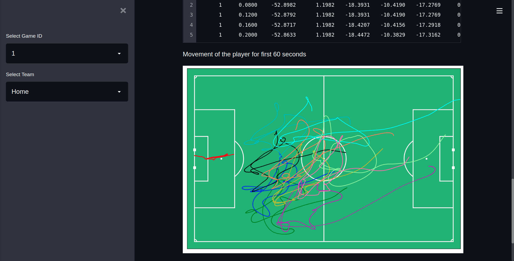

# Football analytics web app



> Analysing event data of sample football games
---

### Table of Contents

- [Description](#description)
- [Data](#data)
- [How To Use](#how-to-use)
- [References](#references)
---
## Description
I have built an interactive web app to explore the events and tracking data of diffferent football matches all together. 


#### Technologies
- pandas
- matplotlib
- numpy
- streamlit

---
## Data
the sample data can be found in Metrica's github repository here: [https://github.com/metrica-sports/sample-data](https://github.com/metrica-sports/sample-data)


---
## How To Use
#### Installation

clone this repository

```bash
git clone "https://github.com/Hasnat79/football_analytics_web_app" 
```


open terminal on the same folder. 

```ps
pip install -r requirement.txt
```
#### API References

run events analysis of the data

```
streamlit run events_analysis_app.py
```
---
## References 
- [LaurieOnTracking](https://github.com/Friends-of-Tracking-Data-FoTD/LaurieOnTracking)
- [metrica-sports/sample-data](https://github.com/metrica-sports/sample-data)

[Back To The Top](#football-analytics-web-app)

---
## Author Info

- Twitter - [@hasnat_omi](https://twitter.com/hasnat_omi)
- Email - [hasnatabdullah79@gmail.com](hasnatabdullah79@gmail.com)

[Back To The Top](#football-analytics-web-app)


